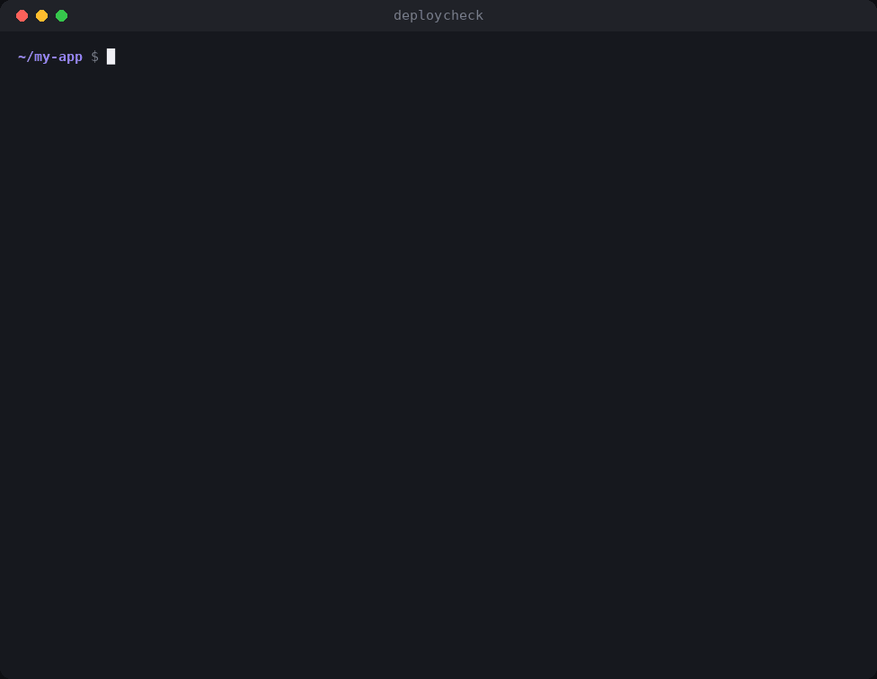

<div align="center">

# deploycheck

**Catch the bugs that work on your laptop and break when you deploy.**

[](https://github.com/peeyushp00-create/deploycheck/actions/workflows/ci.yml)
[](https://www.npmjs.com/package/deploycheck)
[](LICENSE)




</div>

## Why

Some bugs never show up on your machine. They wait for the deploy:

- `import Studio from './Contentstudio'` works on Windows and macOS, where file names ignore case. Vercel, Render and Docker run Linux, so the build fails with **`Module not found`**.
- `process.env.STRIPE_SECRET_KEY` works locally because it's in your `.env`. Nobody added it to `.env.example` or the hosting dashboard, so production **crashes on the first request**.
- A `.env` that isn't in `.gitignore` is one `git add .` away from **putting your secrets in the repo history**.

`deploycheck` finds all of these in one command, before you push — and fixes most of them for you.

## Quick start

```bash
npx deploycheck          # check the project
npx deploycheck --fix    # fix what can be fixed automatically
```

Add it to your build so problems never ship:

```json
{
  "scripts": {
    "prebuild": "deploycheck"
  }
}
```

## Checks

### `case`: import case

Finds imports whose letter case doesn't match the file on disk, plus files whose names differ only by case.

```console
src/routes/+page.svelte:3:30  ✖ import "$lib/components/Contentstudio.svelte"
  → file on disk is "src/lib/components/ContentStudio.svelte" — use "$lib/components/ContentStudio.svelte"
```

- Reads real directory listings, so it catches the bug on Windows and macOS, where it's invisible.
- Understands relative imports, `tsconfig.json` / `jsconfig.json` path aliases (with `extends`), SvelteKit's `$lib`, extensionless imports, `index` files and TypeScript's `./file.js → file.ts` convention.
- In monorepos, each app (`frontend/`, `apps/web/` …) uses its own config and aliases.
- `--fix` rewrites only the wrong part of each import, keeping quotes, extensions and `?query` suffixes.

### `env`: environment variables

Compares every variable your code reads with your `.env.example`, and checks real `.env` files stay out of git.

```console
✖ Missing from frontend/.env.example
  SUPABASE_SERVICE_KEY  frontend/src/lib/server/db.ts:1:24
✖ backend/.env is committed to git — anyone with the repo can read it
⚠ Not used anywhere, listed in frontend/.env.example
  OLD_ANALYTICS_ID
```

| Where | Detected |
| --- | --- |
| Node.js | `process.env.X`, `process.env['X']`, `process.env?.X`, `const { X, Y: y } = process.env` |
| Vite / Astro | `import.meta.env.X` |
| SvelteKit | `$env/static/private`, `$env/static/public`, `$env/dynamic/*` (including `env as alias`) |
| Bun / Deno | `Bun.env.X`, `Deno.env.get('X')` |
| Python | `os.environ['X']`, `os.environ.get('X')`, `os.getenv('X')`, `environ[...]`, `getenv(...)` |
| Prisma | `env("DATABASE_URL")` in `schema.prisma` |

- Each folder is checked against its nearest `.env.example` (`.env.sample`, `.env.template`, `.env.dist` and `example.env` work too).
- Built-in variables (`NODE_ENV`, `DEV`, `CI`, `VERCEL_*`, `GITHUB_*`, `npm_*` …) are skipped automatically.
- `--fix` appends missing variables to the right example file, with a comment saying where each is used.
- Unused variables are warnings; use `--strict` to fail on them.

Both checks ignore comments, docstrings and text inside template strings, so commented-out code never causes a false alarm.

## Options

```bash
npx deploycheck                         # all checks, current folder
npx deploycheck ./frontend              # another folder
npx deploycheck --only env              # just one check
npx deploycheck --ignore-var 'SENTRY_*' # skip variables you set elsewhere
```

| Option | Description |
| --- | --- |
| `--fix` | Fix everything that can be fixed automatically |
| `--only <checks>` / `--skip <checks>` | Choose checks: `case`, `env` (comma separated) |
| `--ignore <folder>` | Skip a folder by name (repeatable). `node_modules`, `venv`, `dist`, `build`, `.svelte-kit`, `.next` and similar are always skipped |
| `--strict` | Treat warnings as errors |
| `--format <type>` | `text` (default), `json`, or `github` (chosen automatically inside GitHub Actions) |
| `--no-color` | Disable colored output (`NO_COLOR` is respected too) |
| `--alias <key=path>` | **case:** add a path alias, e.g. `--alias ~=src` |
| `--no-collisions` | **case:** don't report names that differ only by case |
| `--example <file>` | **env:** use one example file for the whole project |
| `--ignore-var <name>` | **env:** skip a variable; a trailing `*` matches a prefix |
| `--no-unused` | **env:** don't report unused variables |
| `--no-git` | **env:** skip the `.gitignore` / committed-file checks |

Exit codes: `0` ready to deploy · `1` problems found · `2` invalid usage.

## GitHub Action

Problems appear as annotations on the exact lines of your pull request.

```yaml
# .github/workflows/deploycheck.yml
name: deploycheck
on: [push, pull_request]

jobs:
  deploycheck:
    runs-on: ubuntu-latest
    steps:
      - uses: actions/checkout@v4
      - uses: peeyushp00-create/deploycheck@v0
        with:
          args: --strict          # optional
```

## Node.js API

```js
import { runChecks } from 'deploycheck';

const { runs, errors } = runChecks('./my-app', { only: ['env'] });
for (const run of runs) console.log(run.check.title, run.errors, run.result);
```

`scanImports(dir, options)` and `scanEnv(dir, options)` run a single check and return its raw result.

## How it works

```
src/
├── cli.js            argument parsing and output
├── index.js          runner: picks checks, runs them, applies fixes, counts problems
└── checks/
    ├── case/         import case: extract imports → resolve aliases → compare with directory listings
    └── env/          env: mask comments → match usage per language → compare with .env.example → ask git
```

Every check implements the same small interface (`run`, `count`, `fix`, `text`, `github`), so adding a new one means adding a folder and one line to the runner.

- **No parser, still precise.** Comments are blanked out while keeping every character's position, so targeted patterns can find imports and variables with exact line and column numbers.
- **Linux rules on any OS.** Each import path is resolved one segment at a time against the real directory listing: an exact match is fine, a match that only works when case is ignored is a bug.
- **Git as the source of truth.** `git ls-files` and `git check-ignore` decide whether a `.env` file is committed or unprotected; outside a repository these checks are skipped.
- **Fast and dependency-free.** Checks the 2,500-file SvelteKit monorepo in under a second with nothing but Node.js.

## Development

```bash
git clone https://github.com/peeyushp00-create/deploycheck.git
cd deploycheck
npm install        # only TypeScript, for type-checking the JSDoc types
npm run check      # type-check, run the tests, then run deploycheck on itself
```

Tests use Node's built-in test runner and run on Linux, Windows and macOS with Node 18, 20 and 22 in CI.

## License

[MIT](LICENSE) © 2026 Peeyush
